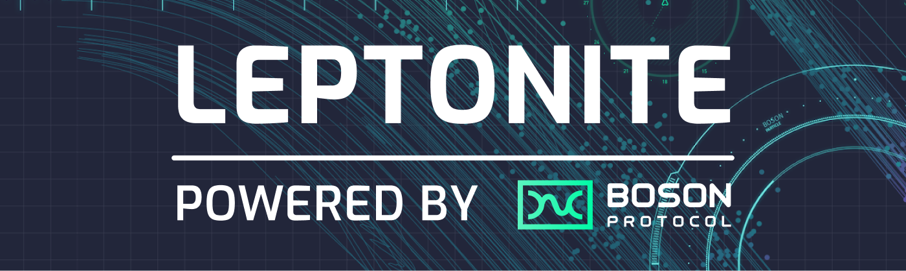
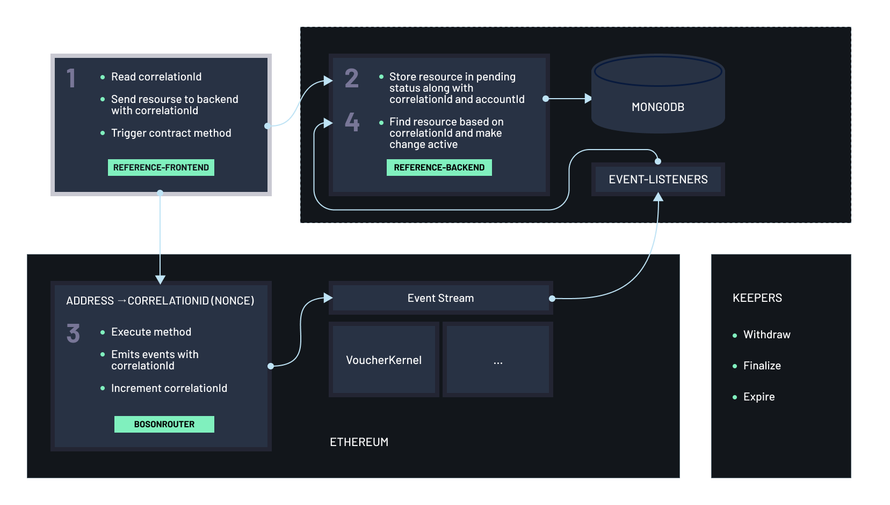

[](https://bosonprotocol.io)

<h1 align="center">Boson Protocol Reference Frontend</h1>


[](https://gitter.im/bosonprotocol/community)

This is a reference app meant to show how to integrate Boson into a React front-end. Questions and comments encouraged!

Live demo running on the Rinkeby test network: \
https://reference-app.bosonprotocol.io

---
**Table of Contents**:

- [Local Development](#local-development)
  - [Prerequisites](#prerequisites)
  - [Configuration](#configuration)
  - [Run](#run)
  - [Build](#build)
  - [Test](#test)
  - [Code Linting & Formatting](#code-linting--formatting)
- [Design & Architecture](#design--architecture)
- [Contributing](#contributing)
- [License](#license)

---
## Local Development

### Prerequisites

For local development of the reference-frontend, your development machine will need a few
tools installed.

At a minimum, you'll need:
* Node (12.20)
* NPM (> 6)
* Ruby (2.7)
* Bundler (> 2)
* Git
* Docker
* direnv

For instructions on how to get set up with these specific versions:
* See the [OS X guide](docs/setup/osx.md) if you are on a Mac.
* See the [Linux guide](docs/setup/linux.md) if you use a Linux distribution.

---
### Configuration
Prior to running the application, you must set up a `.env` file in the project's root directory with the following environment variables:
 - `REACT_APP_BACKEND_BASE_URL` - This is a URL for the reference backend.
 - `REACT_APP_FRONT_END_LOCALSTORAGE_VERSION` - This is the version of the local storage buster (can be defaulted to "1.0")
 - `GENERATE_SOURCEMAP` - This is a boolean and can be defaulted to false;

---
### Run
To run the app, execute the following commands from the root directory:

```shell script
npm install
npm run start
```

A browser window will open at http://localhost:3000/ with a live version of the 
code. You're all set to edit and have it rerender there.

---
### Build

We have a fully automated local build process to check that your changes are
good to be merged. To run the build:

```shell script
./go
````

By default, the build process fetches all dependencies, compiles, lints,
formats and tests the codebase. There are also tasks for each step. This and
subsequent sections provide more details of each of the tasks.

To fetch dependencies:

```shell script
./go dependencies:install
```

---
### Test

All tests are written using [Jest](https://jestjs.io/).

To run the unit tests:

```shell script
./go tests:unit
```

---
### Code Linting & Formatting

Both the app itself and the tests are linted and formatted as part of
the build process.

For the tests, we use:
* [eslint](https://eslint.org/) for linting
* [prettier](https://prettier.io/) for formatting

To lint the app:

```shell script
./go app:lint
```

This will check if the linter is satisfied. If instead you want to attempt to
automatically fix any linting issues:

```shell script
./go app:lint_fix
```

To check the formatting of the app:

```shell script
./go app:format
```

To automatically fix formatting issues:

```shell script
./go app:format_fix
```

Similarly, for the tests, to perform the same tasks:

```shell script
./go tests:lint
./go tests:lint_fix
./go tests:format
./go tests:format_fix
```

---
## Design & Architecture

The application architecture is as depicted below. There are various components to this:
 - `Frontend`
 - `Backend`
 - `Database` (this is part of the `reference-backend` repository)
 - `Cloud functions` (these are part of the `reference-backend` repository)
   - `Keepers service`
   - `Event Listeners`
 - Smart contracts (these must be deployed to the Ethereum network as described in the `contracts` repository)

[](#design-&-architecture)

---
## Contributing

We welcome contributions! Until now, Boson Protocol has been largely worked on by a small dedicated team. However, the ultimate goal is for all of the Boson Protocol repositories to be fully owned by the community and contributors. Issues, pull requests, suggestions, and any sort of involvement are more than welcome.

If you have noticed a bug, [file an issue](/issues). If you have a large pull request, we recommend filing an issue first; small PRs are always welcome.

Questions are also welcome, as long as they are tech related. We can use them to improve our documentation.

All PRs must pass all tests before being merged.

By being in this community, you agree to the [Code of Conduct](CODE_OF_CONDUCT.md). Take a look at it, if you haven't already.

---
## License

Licensed under [LGPL v3](LICENSE).
